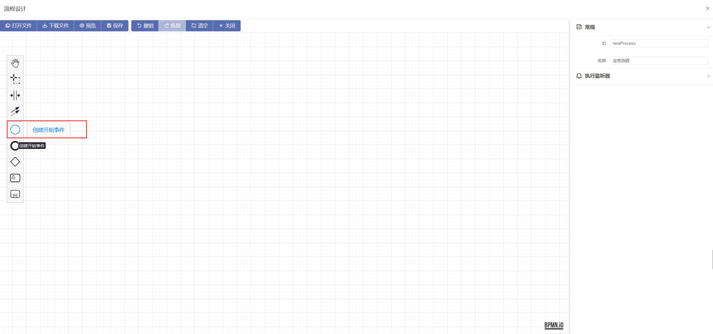

# 流程设计

## 1. 流程定义

新增流程，填写流程定义key，流程定义名称。

## 2. 流程设计

流程图以【开始事件】开始，以【结束事件】结束。

用户任务，填写任务id，任务名称，任务处理用户固定。

多实例任务，用户任务包括【单实例任务】接收人多个会抢占式签收办理该件，【并行多实例任务】接收人多个可同时办理该件，【串行多实例任务】接收人多个会按顺序办理该件。

流转条件，排他网关出来的线路默认配置流转条件表达式。

设计完成后点击保存即可。

# 流程部署

## 1. 流程部署

在流程设计列表点击【部署】，部署当前流程，部署后可在【流程部署】列表查看，也可在【流程部署】列表直接上传文件进行部署。

# 新增事项

## 1. 新增事项

在【事项管理】菜单下新增事项，绑定相应的流程，配置应用url，系统中文名和英文名。

# 表单管理
## 1.业务表管理

选择对应的系统，可以添加数据库已有的表，表名需以y9_form_开头，也可创建新表。

填写表名，添加相应的字段，【保存】只保存数据，不会生成或修改数据库表结构；【新生成表】数据库如果已存在表结构，会清空数据，删除对应的表，重新生成表结构；【修改表结构】已存在的数据库表添加字段，不会清空数据。

## 2.数据字典

添加数据字典，用于表单绑定多选框，单选框，下拉框数据。

## 3. 表单设计

表单设计官方使用手册：https://form.making.link/docs/manual/introduction.html

### 3.1添加表单

添加表单后，点击【表单设计】，进入设计页面。

可以直接导入模板修改。

也可使用表格布局重新设计。

### 3.2表单样式

在【表单属性】的表单样式中添加表单的样式后，在字段的自定义class中引用。

### 3.3绑定数据库字段

表字段绑定数据库表字段，选择对应的元素，点击【字段标识】输入框，弹出字段绑定页面。

字段变蓝，或字段标识有已绑定，说明已绑定成功。

### 3.4默认字段

guid和processInstanceId为默认隐藏字段，拖拉单行文本字段后勾选隐藏即可。

### 3.5动态默认值

输入框动态默认值，以$_加字段名，前端工程解析赋值。

### 3.6数据字典使用

选择下拉框字段，可使用静态数据或动态数据。

动态数据绑定数据字典，点击数据字典输入框绑定数据字典，方法函数可根据前端工程实现改变。

### 3.7字段必填

### 3.8字段事件绑定

### 3.9意见框绑定

点击输入框选择意见框进行绑定。

### 3.10附件列表

附件列表字段标识值为固定值custom_file。

### 3.11打印表单

设计专门的打印表单。

# 意见框管理

## 1.添加意见框

添加意见框，用于与事项绑定。

#  动态角色
## 1.添加动态角色

添加动态角色，用于事项节点授权。

# 按钮管理

## 1.添加按钮

添加发送按钮，事项配置发送按钮后，会显示在发送下拉菜单，前端根据唯一标识实现按钮方法。

普通按钮直接显示。

# 视图类型

## 1.添加视图类型

可在视图配置中使用。

# 事项配置

## 1. 表单配置

新部署流程时，需要重新绑定表单。

绑定表单可以选择前端需要显示的页签，不勾选则不显示。

## 2. 权限配置

权限配置可以绑定多个类型的权限主体。

## 3.意见框配置

绑定意见框，不绑定角色则全部人可以填写，绑定角色则该角色人员可以填写，【必填意见】为是时，发送时会校验是否已填写意见，没有填写则提示。

## 4.打印模板配置

绑定打印表单

## 5.按钮配置

按钮不绑定角色则所有人可见，绑定角色则角色内的人可见。

## 6.视图配置

可以配置表单上已绑定的字段，也可自定义字段，需要配合前后端代码实现。

# 应用访问

浏览器直接访问应用url。

